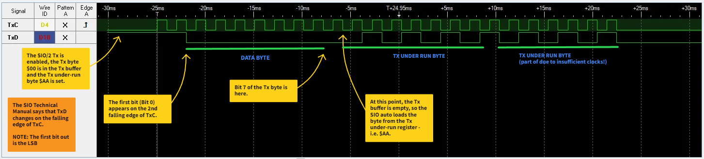
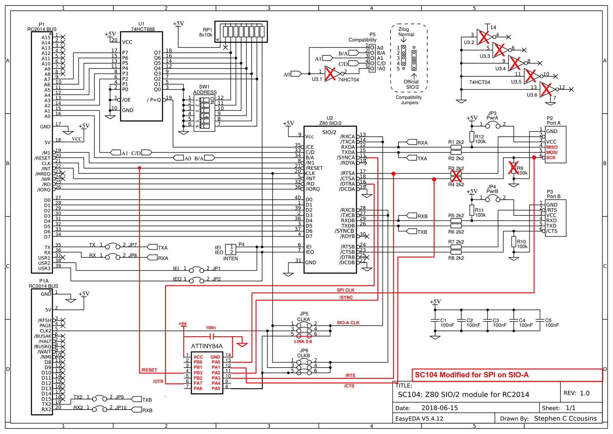
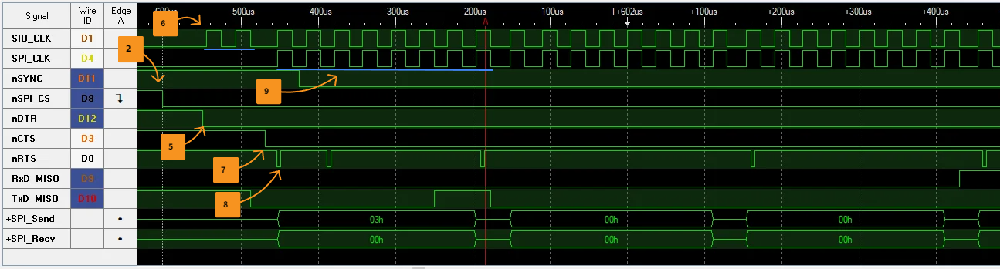
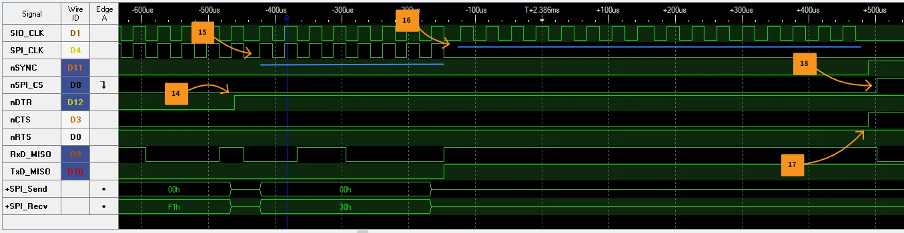
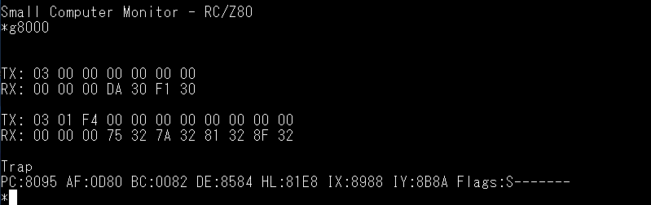

# Can a Zilog SIO/2 serial chip handle SPI communication?
 
I've been scoping out the goundwork for a possible RetroDuino-Z80 board along the lines of my RetroDuino-8085 and got intrigued by the possibility of using a Z80 SIO/2 chip as an SPI device.
 
My first thought was - no way, why would an SIO/2 know how to handle SPI messages! But then I started reading through the Zilog SIO Technical Manual and to quote [Edmund Blackadder](https://en.wikipedia.org/wiki/Edmund_Blackadder), I had a cunning plan.

Long story short, yes you can convince a Zilog SIO/2 to handle SPI messages. It just needs a little bit of assistance.

The key is to configure the SIO/2 for synchronous mode with an external sync. Note that I'm using an SIO/2 device and only channel A can do this. The limitation is due to the various bonding options for the SIO/0, SIO/1 and SIO/2 chips and what signals are not present. With the SIO/2, there is no SYNC_B pin.

Below is what I've achieved so far:

# SPI Transmit

This was easily the simplest to achieve as all I needed to do was provide a suitable clock signal into the TxCA pin. However, the clock should only be present when there is a byte to transmit. If the clock is applied continuously and there is no data in the transmit buffer, then the SIO will clock out the transmit sync character that has been programmed into WR6 (Write Register 6).

I discovered that if I were to:
1. Write the byte to the transmit buffer
2. Enable the transmitter (WR5 bit 3)
3. Apply a series of clock pulses to the TxCA

Then the SIO/2 would clock out the byte on TxDA. The SIO Technical Manual says that TxD changes on the falling edge of TxC - just like SPI Mode 0.

What I did notice was that the data came out LSB first and that the data started appearing on the falling edge of the second clock pulse.

(Click the image for a larger one).

# SPI Receive

The SIO Technical Manual says that receive data is sampled on the rising edge of RxC - just like SPI Mode 0.

Receiving data was more difficult. I had to set SYNC_A low at the right time. I hit a further stumbling block when I got 3 random bytes back at the start of the received message and couldn't seem to receive the whole message.

After a bit of playing around, I discovered that the SIO/2 in synchronous mode doesn't quite work like an AVR SPI interface. There is the exchange of bytes just like SPI, but the SIO/2 seems to have a 3 byte receive FIFO. After transmitting each byte, I checked RR0 (Read Register 0) bit 0 to see if a byte was available. It appears the byte is only available once it had passed though the FIFO. Once I figured that out, I could then receive the first few bytes that the remote SPI device was sending.

It took a little bit more experimenting to get the complete message out as I needed to apply additional clocks to the RxC pin in order to push the final few bytes out of the receive FIFO.

# The Hardware

I have a great little retro system based around several boards designed by Steve Cousins at [Small Computer Central](https://smallcomputercentral.com/). My setup has:
- [SC108](https://smallcomputercentral.com/sc108-z80-processor-rc2014/) Z80 Processor Module
- [SC110](https://smallcomputercentral.com/sc110-z80-serial-rc2014-3/) Serial and Timer Module
- [SC129](https://smallcomputercentral.com/sc129-digital-i-o-rc2014/) Digital I/O Module
- SC145 CompactFlash Module
- [SC112](https://smallcomputercentral.com/sc112-modular-backplane-rc2014/) 6 Slot Modular Backplane

In order to investigate further the possibility of using an SIO/2, I bought an [SC104](https://smallcomputercentral.com/sc104-z80-sio-2-module-rc2014/) SIO/2 PCB from Steve's [Tindie store](https://www.tindie.com/stores/tindiescx/) that I've modified to support my experiments.

The clocks and signals are all handled by an TINY84A. I had hoped to use one of the little 8-pin TINY85 chips but I needed a bit more I/O than it could provide without disabling the RESET pin. Note that the TINY84A is just generating clocks and discrete signals for the SIO/2 and doesn't do any of the serial-parallel and parallel-serial conversions. That is all being done by the SIO/2.

This is my modified version of Steve's SC104 schematic:

(Click the image for a larger one).

These are the sequence of signals and events that happen as the SPI data is exchanged:

 1. The SIO/2 is configured for synchronous operation with an external sync
 2. SPI slave device CS (or SS) pin goes low (an output pin on my SC129 module)
 3. The first byte of the message to transmit is loaded into the SIO/2 Tx register
 4. The SIO/2 receiver and transmitter are enabled
 5. The SIO/2 DTR_A is set low to tell the TINY84A to start the pre-transmission sequence
 6. The TINY84A generates 2 clock pulses to the SIO/2 (TxCA & RxCA) - no clock pulses to the SPI device
 7. The TINY84A then sets SIO/2 CTS_A low to signal that pre-transmission has completed
 8. The SIO/2 RTS_A is pulsed low to tell the TINY84A to generate 8 clock pulses for the SIO and the SPI device
 9. The TINY84A generates the 8 pulses, setting SIO/2 SYNC_A low shortly after the first rising edge of the 1st of the 8 clock pulses
10. The SIO/2 hardware clocks out the Tx byte and reads in the Rx byte
11. A check is made to see if the SIO/2 has a byte to read (byte is read and stored if available)
12. Wait for the SIO/2 to signal it's ready for another Tx byte

The sequence then repeats steps 8 -> 12  until all the bytes have been transmitted. Below is an annotated screenshot from my LA showing the above steps:

(Click the image for a larger one).

Once the last byte has been transmitted, there is a "tidy up" sequence:

13. The SIO/2 transmitter is disabled
14. The SIO/2 DTR_A is set high to signal the end of the transmission.
15. The TINY84A generates any remaining blocks of 8 clock pulses
16. The TINY84A detects DTR_A going high and generates 16 additional clock pulses to the SIO/2 (TxCA & RxCA) - no more clock pulses to the SPI device
17. Keep checking to see if the SIO/2 has a byte to read (byte is read and stored if available) until the TINY84A sets SIO/2 CTS_A & SYNC_A high
18. SPI slave device CS (or SS) pin goes high (an output pin on my SC129 module)
19. The SIO/2 receiver is disabled

The tidy up sequence mainly generates additional clocks for the SIO/2 to make it give up the remaining received bytes that are in the Rx FIFO.

Below is an annotated screenshot from my LA showing the above steps:

(Click the image for a larger one).

And finally the output from my test code that is reading from a Microchip 25LC256 SPI EEPROM:

# Still to do
- Discover a reliable maximum clock speed for the SIO & SPI clock signal.
- Test the setup against a MicroSD card and read/write from/to the FAT filesystem.
